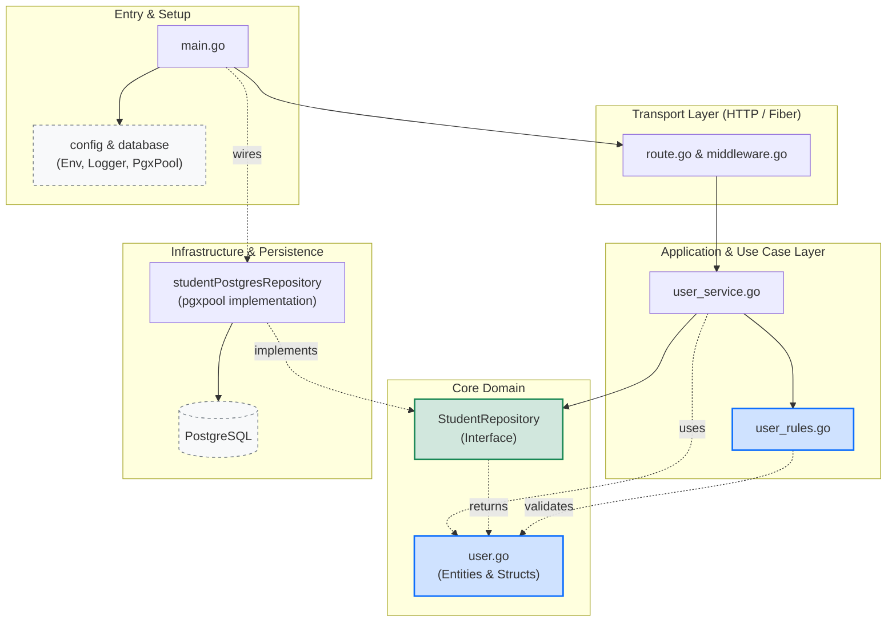

# Laporan Pengujian API — Praktikum Backend Lanjut Pertemuan 2

**Mata Kuliah:** Backend Lanjut
**Pertemuan:** 2
**Framework:** Go + Fiber v2
**Storage:** PostgreSQL (driver `pgx/v5` & pool `pgxpool`)
**Server:** `http://localhost:3000`
**Tanggal Pengujian:** 9 September 2026
**Tool Pengujian:** Postman (collection: `Tugas_Pertemuan_2.postman_collection.json`)
**Arsitektur:** Clean Architecture (versi ringan — service + repository + model + helper)

> **Versi program:** Pertemuan ke-2 versi lanjut. Setelah versi pertama dengan slice in-memory dan versi kedua dengan PostgreSQL raw query di handler, kini kode disusun ulang mengikuti **Clean Architecture** ringan: handler dipindahkan ke `service` (use case), repository dipisahkan dari pengetahuan domain, model berdiri sendiri, dan `helper` memuat konversi HTTP. HTTP contract (route, body, status code) tetap sama sehingga pengujian tidak perlu diulang dari awal.

---

## 1. Informasi Umum

API yang diuji adalah service CRUD untuk resource **users** (nama struct: `model.Student`, path: `/api/v1/students`) dengan prefix `/api/v1`. Setiap pengujian dilakukan menggunakan Postman dan menekankan **status HTTP** yang di-return oleh server, bukan hanya isi body response.

### 1.1 Endpoint yang diuji

| No | Method | Path                    | Tujuan                          | Status Sukses        |
|----|--------|-------------------------|---------------------------------|----------------------|
| 1  | POST   | `/api/v1/students`      | Membuat student baru            | 201 Created          |
| 2  | GET    | `/api/v1/students`      | Mengambil daftar + filter/sort  | 200 OK               |
| 3  | GET    | `/api/v1/students/:id`  | Mengambil detail student        | 200 OK / 404         |
| 4  | PUT    | `/api/v1/students/:id`  | Mengganti seluruh data student  | 200 / 422 / 404 / 409 |
| 5  | PATCH  | `/api/v1/students/:id`  | Memperbarui sebagian data       | 200 / 400 / 404 / 422 |
| 6  | DELETE | `/api/v1/students/:id`  | Menghapus student               | 204 No Content / 404 |
| 7  | GET    | `/api/v1/health`        | Health check + DB ping          | 200 / 503            |

### 1.2 Struktur Proyek & Tanggung Jawab Tiap File

```
students_api/
├── main.go                     # bootstrap: env → pool → repo → service → app
├── go.mod                      # module tugas2; dependensi fiber, pgx, slog
├── .env, .env.example          # konfigurasi runtime
├── migrations/
│   └── 001_create_students.sql # CREATE TABLE users + indeks UNIQUE/email
├── logs/                       # output slog ke file via lumberjack (rotasi)
├── config/
│   ├── env.go                  # LoadEnv, GetEnv, GetEnvInt (godotenv)
│   ├── app.go                  # NewApp: middleware + route + 404 handler
│   └── logger.go               # NewLogger: slog JSON → stdout + file rotator
├── database/
│   └── postgres.go             # NewPool(ctx): DSN + ParseConfig + Ping
├── middleware/
│   └── middleware.go           # requestid, recover, helmet, cors, logger, RequireJSON
├── route/
│   └── route.go                # Register: pemetaan URL → method pada service
├── helper/
│   ├── request.go              # RequestContext, ParamID, ParseListQuery
│   └── response.go             # Success, SuccessList, Created, NoContent, Fail, FailValidation
├── app/
│   ├── model/
│   │   └── user.go             # Student, CreateStudentRequest, Replace/Patch, WebResponse, Meta, ListQuery
│   ├── repository/
│   │   └── user_repository.go  # interface StudentRepository + impl pgx; sentinel error
│   └── service/
│       ├── user_service.go     # StudentService: use case + handler Fiber
│       ├── user_rules.go       # ValidateCreate/Replace, ApplyPatch, IsEmptyPatch, isValidEmail
│       └── user_rule_test.go   # unit test untuk CountTotalPages & ApplyPatch
├── handler.go                  # ⚠ kode lama — tidak dipakai main.go lagi (dead code)
├── helper.go                   # ⚠ kode lama — tidak dipakai route/service (dead code)
├── api_test.http               # REST Client test untuk VS Code
├── Tugas_Pertemuan_2.postman_collection.json
└── laporan.md                  # laporan ini
```

#### Tabel Tanggung Jawab Tiap Modul

| Modul / File                | Tanggung jawab                                                                 |
|-----------------------------|--------------------------------------------------------------------------------|
| `main.go`                   | Hanya perakitan: load env → buka pool → buat repository → buat service → buat app → listen + graceful shutdown. Tidak ada logika bisnis. |
| `config/env.go`             | Membaca `.env` via godotenv; helper `GetEnv`/`GetEnvInt` dengan nilai default.  |
| `config/app.go`             | Konstruktor `*fiber.App`: mendaftarkan middleware, mendaftarkan route, menambah fallback 404, serta ErrorHandler global. |
| `config/logger.go`          | `slog` JSON handler yang menulis ke stdout **dan** file `logs/app.log` dengan rotasi `lumberjack` (10 MB × 5 file × 14 hari). |
| `database/postgres.go`      | Membangun `pgxpool.Pool`; `Ping()` saat start-up memvalidasi kredensial.       |
| `middleware/middleware.go`  | `requestid`, `recover`, `helmet`, `cors`, `RequestLogger` (slog ber-struktur), dan `RequireJSON` untuk body POST/PUT/PATCH. |
| `route/route.go`            | `Register` memetakan URL ke method pada `*service.StudentService`; tidak berisi logika apa pun. Health check inline di sini. |
| `helper/request.go`         | `RequestContext` (timeout 5 detik), `ParamID` (parse + validasi id), `ParseListQuery` (whitelist `sort`, batas `limit`, default aman). |
| `helper/response.go`        | Konstruktor response seragam: `Success`, `SuccessList`, `Created` (Location), `NoContent`, `Fail`, `FailValidation`. |
| `app/model/user.go`         | Struct domain (`Student`), tipe request/response, `WebResponse`, `Meta`, `ListQuery` (beserta `Offset()`). Tidak mengimpor fiber/pgx. |
| `app/repository/user_repository.go` | Interface `StudentRepository` + implementasinya `studentPostgresRepository`. Sentinel error `ErrNotFound`, `ErrDuplicate`. Whitelist `kolomUrut`. Query parameterized. |
| `app/service/user_service.go`     | **Use case + handler**. Method `List/Get/Create/Replace/Patch/Delete` menerima `*fiber.Ctx`, memanggil rule pada `user_rules.go`, lalu memanggil repository. |
| `app/service/user_rules.go`       | Aturan bisnis murni (tanpa `*fiber.Ctx`): `ValidateCreate`, `ValidateReplace`, `ApplyPatch`, `IsEmptyPatch`, `CountTotalPages`, `isValidEmail`. Bisa di-`unit-test` tanpa HTTP. |
| `app/service/user_rule_test.go`   | Unit test Go (`testing`) untuk `CountTotalPages` & `ApplyPatch`.                  |
| `migrations/001_create_students.sql` | Skema tabel `users` + indeks `users_username_lower_key` (UNIQUE) + `users_email_lower_idx`. |
| `handler.go`, `helper.go` (root)   | Sisa dari versi in-memory. **Saat ini tidak diimpor** oleh `main.go`/`route.go` — dead code yang dapat dihapus tanpa mengubah perilaku. |

### 1.3 Middleware Aktif (urutan eksekusi)

`middleware.Register(app, logger)` mendaftarkan middleware global dengan urutan:

1. `requestid` — memberi setiap request satu ID unik (`requestid`).
2. `recover` — menangkap panic agar server tidak crash.
3. `helmet` — header keamanan dasar.
4. `cors` — Cross-Origin Resource Sharing default.
5. `RequestLogger(logger)` — log `slog` JSON dengan `request_id`, `method`, `path`, `status`, `duration`, `ip`.

Untuk grup `/api/v1/students` ditambahkan middleware lokal **`RequireJSON`**: method `POST/PUT/PATCH` wajib memiliki header `Content-Type: application/json`, bila tidak akan return `415 Unsupported Media Type` sebelum masuk ke `service`.

### 1.4 Status `503 Service Unavailable` (baru)

Karena `GET /api/v1/health` kini ikut melakukan `pool.Ping` dengan timeout 2 detik, server dapat return `503` ketika database tidak dapat dihubungi. Skenario ini tidak diuji di sini karena pengujian difokuskan pada endpoint CRUD.

### 1.5 Self-Check: Pemeriksaan Sendiri Proyek (Checklist Dosen)

Pemeriksaan berikut dibuktikan di bagian **7. Checklist Pemeriksaan Sendiri**.

| Yang diperiksa                  | Harus                                                           | Hasil |
|---------------------------------|-----------------------------------------------------------------|-------|
| Import pada package `app/model` | Tidak ada satu pun package dari proyek Anda sendiri            | ✅    |
| Import pada package `app/repository` | Tidak ada gofiber sama sekali                              | ✅    |
| Isi package `app/service`       | Tidak ada satu pun perintah SQL                                 | ✅    |
| Isi file `route`                | Tidak ada `if` untuk validasi maupun business rules             | ✅    |
| Isi file `main.go`              | Tidak ada handler; hanya urutan perakitan                        | ✅    |

### 1.6 Architecture Map (Dependency Graph)

Diagram berikut menunjukkan **arah import** antar-package pada proyek (siapa mengimpor siapa). Anak panah mengarah ke package yang **bergantung** (`A --> B` berarti `A` mengimpor `B`).



### 1.7 Pemetaan ke Empat Layer Clean Architecture

| Layer Clean Architecture          | Folder / file proyek                                     | Catatan                                                                 |
|-----------------------------------|----------------------------------------------------------|-------------------------------------------------------------------------|
| **1. Entities** (aturan bisnis enterprise paling murni) | `app/model/user.go`, `app/service/user_rules.go` | Struct domain & fungsi validasi/patch. Tidak mengimpor fiber, pgx, atau package lain proyek. |
| **2. Use Cases** (aturan aplikasi spesifik)            | `app/service/user_service.go`              | Orkestrasi alur per endpoint: parse → validate → repo → response.     |
| **3. Interface Adapters** (konversi data ↔ dunia luar) | `route/route.go`, `helper/request.go`, `helper/response.go`, `app/repository/user_repository.go` (interface + impl pgx) | `route` & `helper` mengkonversi HTTP ↔ domain; `repository` mengkonversi domain ↔ SQL. |
| **4. Framework & Drivers** (detail mekanis: DB, web, UI) | `main.go`, `config/*`, `database/postgres.go`, `middleware/middleware.go`, `logs/`, `migrations/*.sql`, `go.mod` | Hal yang dapat diganti (driver DB, web framework, logger) tanpa menyentuh logika di atas. |

#### Apa yang **disederhanakan** dibanding Clean Architecture murni

- **Service dan handler digabung.** Pada Clean Architecture murni, "use case" menerima input terstruktur (mis. `CreateStudentInput`) dan me-return output/domain error, lalu sebuah `handler` (interface adapter) mengkonversi ke HTTP. Di proyek ini `*service.StudentService.Create` menerima `*fiber.Ctx` langsung — coupling ke Fiber lebih kuat, tetapi jumlah file berkurang dan tracing satu endpoint lebih pendek.
- **Tidak ada `repository.NewStudentRepositoryMock()` di luar paket.** Mock dibuat inline pada unit test (cukup untuk service yang hanya bergantung pada interface `repository.StudentRepository`).
- **Tidak ada `app/usecase` terpisah** dari `app/service`. Aturan murni (`ValidateCreate`, `ApplyPatch`, `CountTotalPages`) tetap dipisah di `user_rules.go` agar bisa di-unit-test tanpa HTTP, tetapi orkestrasi use case hidup di `user_service.go`.
- **DTO tidak sepenuhnya terpisah dari entitas.** `CreateStudentRequest`, `ReplaceStudentRequest`, `PatchStudentRequest` hidup di `app/model` bersama entitas `Student`. Pada Clean Architecture murni, DTO masuk layer Interface Adapter.
- **Error tidak dibungkus dengan error code domain**. Service menerjemahkan error repository langsung ke status HTTP pada helper `translateError` (terletak di `user_service.go`).

#### Apakah struktur ini sepadan, dan mulai dari ukuran apa?

Untuk requirement praktikum ini (6 endpoint CRUD + health + 1 entitas), struktur ini **sepadan** karena biaya setupnya kecil (cukup membagi 13 file ke 4 paket) namun langsung mendapatkan tiga hal: **bisa di-unit-test tanpa basis data** (`app/service` tidak bergantung pada pgx/fiber secara langsung ketika aturan dipanggil lewat `user_rules.go`), **bisa mengganti driver basis data** dengan mengimplementasi ulang `repository.StudentRepository`, dan **bisa mengganti web framework** dengan membuat `*service.StudentService` menerima interface, bukan `*fiber.Ctx`.

**Mulai sepadan ketika:** ada lebih dari satu *use case* kompleks (mis. upload + processing), ada lebih dari satu driver basis data atau lebih dari satu klien (HTTP, gRPC, CLI), atau ketika anggota tim mulai bertambah dan jelas pembagian layer mempercepat code review. Sebagai patokan kasar: ≥ 3 entitas, ≥ 10 use case, atau perlu mengganti driver lebih dari satu kali — pada titik itu setiap layer tambahan menghemat lebih banyak waktu daripada biaya setupnya.

**Konsekuensi struktur ini:**

| Konsekuensi (positif)                                                   | Konsekuensi (negatif)                                                          |
|-------------------------------------------------------------------------|--------------------------------------------------------------------------------|
| Modul `app/service` & `app/repository` **tidak bergantung** pada `main.go` atau routing tertentu — bisa diuji dan diganti. | `app/service` masih mengimpor `github.com/gofiber/fiber/v2` karena `*fiber.Ctx` dipakai langsung; mengganti framework = edit semua method di `user_service.go`. |
| `app/model` **tidak bergantung** pada apa pun dari proyek — bisa dipakai ulang oleh CLI, gRPC, atau test harness. | Ada satu layer yang digabung (service + handler); pemula bisa bingung apakah aturan HTTP (status code) termasuk "business rules". |
| `helper` & `config` berdiri sendiri, mudah di-stub saat testing.          | Dead code (`handler.go` & `helper.go` di root) menambah kebisingan; perlu dihapus agar struktur tetap bersih. |

---

## 2. Skema Basis Data & Migrasi

Berkas migrasi: [students_api/migrations/001_create_students.sql](students_api/migrations/001_create_students.sql).

### 2.1 Skema Tabel `users`

| Kolom        | Tipe             | Constraint                          | Keterangan                                  |
|--------------|------------------|-------------------------------------|---------------------------------------------|
| `id`         | `SERIAL`         | `PRIMARY KEY`                       | Auto-increment oleh PostgreSQL              |
| `username`   | `VARCHAR(50)`    | `NOT NULL`                          | Nama pengguna                               |
| `email`      | `VARCHAR(255)`   | `NOT NULL`                          | Alamat email                                |
| `password`   | `VARCHAR(255)`   | `NOT NULL`                          | Disimpan sebagai hash pada praktikum lanjut |
| `is_active`  | `BOOLEAN`        | `NOT NULL DEFAULT TRUE`             | Status aktif                                |
| `created_at` | `TIMESTAMPTZ`    | `NOT NULL DEFAULT NOW()`            | Timestamp pembuatan otomatis                |

### 2.2 Indeks

| Nama indeks                          | Tipe             | Kolom                  | Tujuan                                                                |
|--------------------------------------|------------------|------------------------|-----------------------------------------------------------------------|
| `users_pkey`                         | Primary Key      | `id`                   | Search by id                                                          |
| `users_username_lower_key` (UNIQUE)  | B-tree unik      | `LOWER(username)`      | Menjamin keunikan tanpa membedakan huruf besar/kecil                  |
| `users_email_lower_idx`              | B-tree           | `LOWER(email)`         | Mempercepat search case-insensitive pada email                       |

### 2.3 Skrip Migrasi Lengkap

```sql
-- students_api/migrations/001_create_students.sql
CREATE TABLE IF NOT EXISTS users (
    id         SERIAL PRIMARY KEY,
    username   VARCHAR(50)  NOT NULL,
    email      VARCHAR(255) NOT NULL,
    password   VARCHAR(255) NOT NULL,
    is_active  BOOLEAN      NOT NULL DEFAULT TRUE,
    created_at TIMESTAMPTZ  NOT NULL DEFAULT NOW()
);

-- Keunikan username tanpa membedakan huruf besar dan kecil.
-- Inilah yang menggantikan pemeriksaan manual di pertemuan 2.
CREATE UNIQUE INDEX IF NOT EXISTS users_username_lower_key
    ON users (LOWER(username));

CREATE INDEX IF NOT EXISTS users_email_lower_idx
    ON users (LOWER(email));
```

### 2.4 Konfigurasi Koneksi

Contoh `.env`:

```env
APP_PORT=3000
DB_HOST=localhost
DB_PORT=5432
DB_USER=postgres
DB_PASSWORD=rahasia
DB_NAME=praktikum_backend
DB_SSLMODE=disable
DB_MAX_CONNS=10
```

Potongan kode `database/postgres.go`:

```go
dsn := fmt.Sprintf(
    "postgres://%s:%s@%s:%s/%s?sslmode=%s",
    config.GetEnv("DB_USER",     "postgres"),
    config.GetEnv("DB_PASSWORD", ""),
    config.GetEnv("DB_HOST",     "localhost"),
    config.GetEnv("DB_PORT",     "5432"),
    config.GetEnv("DB_NAME",     "praktikum_backend"),
    config.GetEnv("DB_SSLMODE",  "disable"),
)
cfg, err := pgxpool.ParseConfig(dsn)
cfg.MaxConns          = int32(config.GetEnvInt("DB_MAX_CONNS", 10))
cfg.MinConns          = 2
cfg.MaxConnLifetime   = time.Hour
cfg.MaxConnIdleTime   = 30 * time.Minute
pool, err := pgxpool.NewWithConfig(ctx, cfg)
if err := pool.Ping(pingCtx); err != nil { /* fatal */ }
```

### 2.5 Penjelasan Singkat

- **`SERIAL`** menyerahkan pembuatan id ke PostgreSQL sehingga tidak ada `nextID++` di Go lagi.
- **`UNIQUE INDEX ... LOWER(username)`** menjamin tidak ada dua user dengan username identik secara case-insensitive, sehingga aplikasi tidak perlu query `SELECT` tambahan sebelum `INSERT` — INSERT langsung gagal dengan kode error PostgreSQL `23505`.
- **`pgxpool`** mengelola banyak koneksi sekaligus; query yang lambat tidak saling menunggu.
- **`pool.Ping()`** saat start-up memvalidasi kredensial sebelum server menerima permintaan pertama.
- **`RETURNING id, created_at`** pada `INSERT`/`UPDATE` me-return nilai yang dibuat database dalam satu perjalanan, tanpa perlu query kedua.

---

## 3. Testing Endpoint

Setiap skenario di bawah menampilkan tiga hal: (1) **request** aktual yang dikirim, (2) **snippet kode yang di-highlight** — diambil dari service layer (pp/service/), rule (pp/service/user_rules.go), atau repository (pp/repository/user_repository.go), dan (3) **penjelasan** singkat tentang status HTTP dan perilaku kode.

> Path telah diubah dari /api/v1/users (versi repository langsung) menjadi /api/v1/students setelah refactor menjadi Clean Architecture. Service menambahkan IsActive: true default untuk Create, sehingga field is_active tidak perlu dikirim.

### 3.1 POST — Membuat Student Baru

**Permintaan**

```http
POST /api/v1/students
Content-Type: application/json

{
  "username": "johndoe",
  "email": "john@example.com",
  "password": "rahasia123"
}
```

**Snippet kode yang di-highlight**

```go
// route/route.go — route mendaftarkan service method langsung
students.Post("/", studentService.Create)

// app/service/user_service.go — StudentService.Create (use case + handler)
func (s *StudentService) Create(c *fiber.Ctx) error {
    ctx, cancel := helper.RequestContext(c)
    defer cancel()
    var req model.CreateStudentRequest
    if err := c.BodyParser(&req); err != nil {
        return helper.Fail(c, fiber.StatusBadRequest,
            "body harus berupa JSON yang valid")
    }
    if errs := ValidateCreate(req); len(errs) > 0 {
        return helper.FailValidation(c, errs)
    }
    newUser, err := s.repo.Create(ctx, model.Student{
        Username: req.Username,
        Email:    req.Email,
        Password: req.Password,
        IsActive: true,
    })
    if err != nil {
        return translateError(c, err, err.Error())
    }
    return helper.Created(c, "student berhasil dibuat", newUser,
        "/api/v1/students/"+strconv.Itoa(newUser.ID))
}

// app/service/user_rules.go — ValidateCreate dipisah agar bisa di-unit-test
func ValidateCreate(req model.CreateStudentRequest) map[string]string {
    errs := map[string]string{}
    if strings.TrimSpace(req.Username) == "" { errs["username"] = "wajib diisi" }
    if !isValidEmail(req.Email)              { errs["email"]    = "format email tidak valid" }
    if len(req.Password) < 8                { errs["password"] = "minimal 8 karakter" }
    return errs
}

// app/repository/user_repository.go — INSERT parameterized dengan RETURNING
err := r.pool.QueryRow(ctx,
    INSERT INTO users (username, email, password, is_active)
     VALUES (, , , )
     RETURNING id, created_at,
    u.Username, u.Email, u.Password, u.IsActive,
).Scan(&u.ID, &u.CreatedAt)
if isUniqueViolation(err) {
    return model.Student{}, ErrDuplicate
}
```

**Screenshot pengujian**

> 📷 *[Screenshots: 01_post_create_success.png — paste Postman screenshot showing 201 Created here]*

**Penjelasan:** Server me-return status **201 Created** saat student berhasil disimpan ke PostgreSQL. Header Location berisi URL resource baru (/api/v1/students/1). Validasi input terjadi di ValidateCreate sebelum query dieksekusi; pelanggaran UNIQUE INDEX users_username_lower_key akan di-return sebagai ErrDuplicate → **409 Conflict**. id di-generate oleh SERIAL PostgreSQL dan created_at di-RETURNING bersamaan dengan INSERT, sehingga hanya satu perjalanan ke database.

---

### 3.2 POST — Tambah Student Kedua dan Ketiga

**Permintaan**

```http
POST /api/v1/students
{ "username": "andini", "email": "andini@example.com", "password": "rahasia123" }

POST /api/v1/students
{ "username": "budi_s", "email": "budi@example.com", "password": "rahasia123" }
```

**Snippet kode yang di-highlight**

```go
// route/route.go — satu endpoint yang sama, dipanggil berulang
students.Post("/", studentService.Create)
```

**Screenshot pengujian**

> 📷 *[Screenshots: 02a_post_create_andini.png — paste screenshot showing 201 Created for student ke-2 here]*

> 📷 *[Screenshots: 02b_post_create_budi.png — paste screenshot showing 201 Created for student ke-3 here]*

**Penjelasan:** Kedua permintaan me-return **201 Created**. Setelah tiga kali INSERT, tabel users berisi 3 baris dengan id 1, 2, dan 3 yang dibuat otomatis oleh PostgreSQL.

---

### 3.3 GET — Pagination dan Sorting

**Permintaan**

```http
GET /api/v1/students?page=1&limit=2&sort=username&order=desc
```

**Snippet kode yang di-highlight**

```go
// helper/request.go — ParseListQuery normalisasi input + whitelist sort
func ParseListQuery(c *fiber.Ctx) model.ListQuery {
    q := model.ListQuery{
        Page:   c.QueryInt("page", 1),
        Limit:  c.QueryInt("limit", 10),
        Search: strings.TrimSpace(c.Query("search")),
        Sort:   c.Query("sort", "id"),
        Order:  strings.ToLower(c.Query("order", "asc")),
    }
    if q.Limit > 100 { q.Limit = 100 }
    if !allowedSort[q.Sort] { q.Sort = "id" }
    if q.Order != "desc" { q.Order = "asc" }
    return q
}

// app/repository/user_repository.go — studentPostgresRepository.FindAll
where, args := buildFilter(q)

// (1) Hitung total sebelum dipenggal
var total int
err := r.pool.QueryRow(ctx,
    "SELECT COUNT(*) FROM users"+where, args...).Scan(&total)

// (2) Ambil satu halaman dari basis data
arah := "ASC"
if q.Order == "desc" { arah = "DESC" }
sqlText := fmt.Sprintf(
    SELECT id, username, email, password, is_active, created_at
     FROM users%s
     ORDER BY %s %s
     LIMIT $%d OFFSET $%d,
    where, kolomUrut[q.Sort], arah, len(args)+1, len(args)+2,
)
args = append(args, q.Limit, q.Offset())
```

**Screenshot pengujian**

> 📷 *[Screenshots: 03_get_pagination_sort.png — paste Postman screenshot showing 200 OK here]*

**Penjelasan:** Status **200 OK**. Filtering (WHERE), sorting (ORDER BY) dan paging (LIMIT/OFFSET) seluruhnya dijalankan PostgreSQL — bukan di slice Go. Whitelist kolomUrut (di repository) & llowedSort (di helper) menutup jalan injection pada ORDER BY. Total baris (	otal) dihitung via COUNT(*) terpisah untuk isi meta. CountTotalPages di user_rules.go dipakai pada service untuk mengisi 	otal_pages.

---

### 3.4 GET — Search dan Filter

**Permintaan**

```http
GET /api/v1/students?search=an&is_active=true
```

**Snippet kode yang di-highlight**

```go
// app/repository/user_repository.go — buildFilter (parameterized)
if q.Search != "" {
    where += fmt.Sprintf(
        " AND (username ILIKE $%d OR email ILIKE $%d)",
        len(args)+1, len(args)+1)
    args = append(args, "%"+q.Search+"%")
}
if q.IsActive != nil {
    where += fmt.Sprintf(" AND is_active = $%d", len(args)+1)
    args = append(args, *q.IsActive)
}
```

**Screenshot pengujian**

> 📷 *[Screenshots: 04_get_search_filter.png — paste Postman screenshot showing 200 OK here]*

**Penjelasan:** Status **200 OK**. Search substring n dipakai pada klausa ILIKE (case-insensitive), sehingga cocok pada username ndini maupun email yang memuat substring n. Filter is_active = TRUE ditambahkan sebagai parameter terpisah — tidak pernah disambung ke teks SQL secara langsung.

---

### 3.5 PUT — Replace Student (Seluruh Field Wajib)

**Permintaan**

```http
PUT /api/v1/students/1
Content-Type: application/json

{
  "username": "john_baru",
  "email": "jb@example.com",
  "is_active": false
}
```

**Snippet kode yang di-highlight**

```go
// app/service/user_service.go — StudentService.Replace
func (s *StudentService) Replace(c *fiber.Ctx) error {
    ctx, cancel := helper.RequestContext(c)
    defer cancel()
    id, valid := helper.ParamID(c)
    if !valid {
        return helper.Fail(c, fiber.StatusBadRequest, "id harus berupa angka positif")
    }
    var req model.ReplaceStudentRequest
    if err := c.BodyParser(&req); err != nil {
        return helper.Fail(c, fiber.StatusBadRequest, "body harus berupa JSON yang valid")
    }
    if errs := ValidateReplace(req); len(errs) > 0 {
        return helper.FailValidation(c, errs)
    }
    result, err := s.repo.Update(ctx, model.Student{
        ID:       id,
        Username: strings.TrimSpace(req.Username),
        Email:    strings.TrimSpace(req.Email),
        IsActive: req.IsActive,
    })
    if err != nil { return translateError(c, err, "gagal memperbarui student") }
    return helper.Success(c, fiber.StatusOK, "student berhasil diganti seluruhnya", result)
}

// app/repository/user_repository.go — Update dengan RETURNING (semua kolom)
err := r.pool.QueryRow(ctx,
    UPDATE users SET username = , email = , is_active = 
     WHERE id = 
     RETURNING id, username, email, password, is_active, created_at,
    u.Username, u.Email, u.IsActive, u.ID,
).Scan(&u.ID, &u.Username, &u.Email, &u.Password, &u.IsActive, &u.CreatedAt)
if errors.Is(err, pgx.ErrNoRows)  { return model.Student{}, ErrNotFound }
if isUniqueViolation(err)         { return model.Student{}, ErrDuplicate }
```

**Screenshot pengujian**

> 📷 *[Screenshots: 05_put_replace_success.png — paste Postman screenshot showing 200 OK here]*

**Penjelasan:** Status **200 OK**. PUT menggantikan seluruh field pada baris dengan id 1 menggunakan satu UPDATE ... RETURNING. Baris yang di-return PostgreSQL menyertakan kembali created_at sehingga field yang tidak ikut diubah tetap benar.

---

### 3.6 PUT — Validasi Gagal (Tanpa Email)

**Permintaan**

```http
PUT /api/v1/students/1
Content-Type: application/json

{
  "username": "john_baru"
}
```

**Snippet kode yang di-highlight**

```go
// app/service/user_rules.go — ValidateReplace adalah pure function
func ValidateReplace(req model.ReplaceStudentRequest) map[string]string {
    errs := map[string]string{}
    if strings.TrimSpace(req.Username) == "" {
        errs["username"] = "wajib diisi pada PUT"
    }
    if !isValidEmail(req.Email) {
        errs["email"] = "wajib diisi dan berformat email pada PUT"
    }
    return errs
}

// helper/response.go — FailValidation → 422
func FailValidation(c *fiber.Ctx, errs map[string]string) error {
    return c.Status(fiber.StatusUnprocessableEntity).JSON(model.WebResponse{
        Success: false, Message: "validasi gagal", Errors: errs,
    })
}
```

**Screenshot pengujian**

> 📷 *[Screenshots: 06_put_validation_422.png — paste Postman screenshot showing 422 Unprocessable Entity here]*

**Penjelasan:** Status **422 Unprocessable Entity**. ValidateReplace mengembalikan errs["email"] sebelum s.repo.Update dipanggil, sehingga tidak ada UPDATE yang dikirim ke PostgreSQL. Respons memuat objek errors dengan key email. Karena ValidateReplace adalah pure function, perilakunya dapat diuji tanpa HTTP — lihat seksi 6.

---

### 3.7 PATCH — Update Sebagian (is_active)

**Permintaan**

```http
PATCH /api/v1/students/1
Content-Type: application/json

{
  "is_active": true
}
```

**Snippet kode yang di-highlight**

```go
// app/service/user_service.go — StudentService.Patch (baca → gabung → simpan)
func (s *StudentService) Patch(c *fiber.Ctx) error {
    ctx, cancel := helper.RequestContext(c)
    defer cancel()
    id, valid := helper.ParamID(c)
    if !valid { /* ... */ }
    var req model.PatchStudentRequest
    if err := c.BodyParser(&req); err != nil { /* ... */ }
    if IsEmptyPatch(req) {
        return helper.Fail(c, fiber.StatusBadRequest, "tidak ada field yang diubah")
    }
    current, err := s.repo.FindByID(ctx, id)
    if err != nil { return translateError(c, err, "gagal mengambil data student") }
    updated, errs := ApplyPatch(current, req)
    if len(errs) > 0 { return helper.FailValidation(c, errs) }
    result, err := s.repo.Update(ctx, updated)
    if err != nil { return translateError(c, err, "gagal memperbarui student") }
    return helper.Success(c, fiber.StatusOK, "student berhasil diperbarui sebagian", result)
}

// app/service/user_rules.go — ApplyPatch (pure, di-unit-test)
func ApplyPatch(current model.Student, req model.PatchStudentRequest,
) (model.Student, map[string]string) {
    errs := map[string]string{}
    if req.Username != nil {
        if strings.TrimSpace(*req.Username) == "" {
            errs["username"] = "tidak boleh kosong"
        } else {
            current.Username = *req.Username
        }
    }
    if req.Email != nil {
        if !isValidEmail(*req.Email) {
            errs["email"] = "format email tidak valid"
        } else {
            current.Email = *req.Email
        }
    }
    if req.IsActive != nil {
        current.IsActive = *req.IsActive
    }
    return current, errs
}
```

**Screenshot pengujian**

> 📷 *[Screenshots: 07_patch_partial.png — paste Postman screenshot showing 200 OK here]*

**Penjelasan:** Status **200 OK**. PATCH membaca baris utuh dengan FindByID, lalu ApplyPatch (pure function) menggabungkan field yang dikirim ke salinan current. Repository hanya butuh satu metode Update; perbedaan PUT/PATCH diputuskan di service. IsEmptyPatch mengembalikan 400 bila body kosong.

---

### 3.8 POST — Tanpa Content-Type

**Permintaan**

```http
POST /api/v1/students   (tanpa header Content-Type)
Body: {"username":"x"}
```

**Snippet kode yang di-highlight**

```go
// middleware/middleware.go — RequireJSON dipasang pada grup /students
var methodsWithBody = map[string]bool{
    fiber.MethodPost:  true,
    fiber.MethodPut:   true,
    fiber.MethodPatch: true,
}

func RequireJSON(c *fiber.Ctx) error {
    if methodsWithBody[c.Method()] {
        ct := c.Get("Content-Type")
        if !strings.HasPrefix(ct, fiber.MIMEApplicationJSON) {
            return helper.Fail(c, fiber.StatusUnsupportedMediaType,
                "Content-Type harus application/json")
        }
    }
    return c.Next()
}

// route/route.go — middleware diterapkan pada grup, bukan per-method
students := api.Group("/students", middleware.RequireJSON)
```

**Screenshot pengujian**

> 📷 *[Screenshots: 08_post_no_content_type.png — paste Postman screenshot showing 415 Unsupported Media Type here]*

**Penjelasan:** Status **415 Unsupported Media Type**. Middleware RequireJSON menolak permintaan sebelum sampai ke StudentService.Create atau bahkan repository — koneksi database tidak terpakai sia-sia.

---

### 3.9 DELETE — Hapus Student

**Permintaan**

```http
DELETE /api/v1/students/2
```

**Snippet kode yang di-highlight**

```go
// app/service/user_service.go — StudentService.Delete
func (s *StudentService) Delete(c *fiber.Ctx) error {
    ctx, cancel := helper.RequestContext(c)
    defer cancel()
    id, valid := helper.ParamID(c)
    if !valid {
        return helper.Fail(c, fiber.StatusBadRequest, "id harus berupa angka positif")
    }
    if err := s.repo.Delete(ctx, id); err != nil {
        return translateError(c, err, "gagal menghapus student")
    }
    return helper.NoContent(c)
}

// app/repository/user_repository.go — studentPostgresRepository.Delete
tag, err := r.pool.Exec(ctx, DELETE FROM users WHERE id = , id)
if err != nil { return fmt.Errorf("menghapus student: %w", err) }
if tag.RowsAffected() == 0 { return ErrNotFound }
return nil
```

**Screenshot pengujian**

> 📷 *[Screenshots: 09_delete_success.png — paste Postman screenshot showing 204 No Content here]*

**Penjelasan:** Status **204 No Content**. Exec me-return 	ag.RowsAffected() — bila 0 berarti id memang tidak ada dan repository menerjemahkannya menjadi ErrNotFound (status 404), bukan false positive "berhasil".

---
## 4. Mapping Error Repository ⇄ HTTP

| Sentinel error (repository) | Status HTTP | Sumber                                                                   |
|-----------------------------|-------------|--------------------------------------------------------------------------|
| ErrNotFound               | 404         | pgx.ErrNoRows atau RowsAffected() == 0                              |
| ErrDuplicate              | 409 Conflict| pgconn.PgError dengan kode 23505 (pelanggaran UNIQUE)               |
| error lain                  | 500         | Kesalahan internal server                                               |

```go
// app/service/user_service.go — translateError (dipindahkan dari handler.go)
func translateError(c *fiber.Ctx, err error, generalMessage string) error {
    switch {
    case errors.Is(err, repository.ErrNotFound):
        return helper.Fail(c, fiber.StatusNotFound, "student tidak ditemukan")
    case errors.Is(err, repository.ErrDuplicate):
        return helper.Fail(c, fiber.StatusConflict, "username sudah dipakai")
    default:
        return helper.Fail(c, fiber.StatusInternalServerError, generalMessage)
    }
}
```

Perubahan penting dibanding versi in-memory: status 409 Conflict kini mungkin muncul ketika INSERT/UPDATE melanggar UNIQUE INDEX users_username_lower_key — sebelumnya versi in-memory hanya mengandalkan loop or _, u := range users.

Catatan: fungsi 	erjemahkanError lama yang berada di handler.go (root) sudah tidak dipanggil lagi. Padanan modern-nya 	ranslateError sekarang menjadi **method private** pada pp/service/user_service.go karena ia mengakses 
epository.ErrNotFound/ErrDuplicate yang merupakan pengetahuan internal service layer.

---

## 5. Ringkasan Hasil Pengujian

| No | Skenario                              | Status yang Diharapkan | Status Aktual | Hasil    |
|----|---------------------------------------|------------------------|---------------|----------|
| 1  | POST create student (valid)           | 201 Created            | 201 Created   | ✅ Lulus |
| 2a | POST student tambahan 1               | 201 Created            | 201 Created   | ✅ Lulus |
| 2b | POST student tambahan 2               | 201 Created            | 201 Created   | ✅ Lulus |
| 3  | GET pagination & sort                 | 200 OK                 | 200 OK        | ✅ Lulus |
| 4  | GET search & filter                   | 200 OK                 | 200 OK        | ✅ Lulus |
| 5  | PUT replace (semua field valid)       | 200 OK                 | 200 OK        | ✅ Lulus |
| 6  | PUT tanpa email                       | 422 Unprocessable      | 422 Unprocess.| ✅ Lulus |
| 7  | PATCH sebagian (is_active)            | 200 OK                 | 200 OK        | ✅ Lulus |
| 8  | POST tanpa Content-Type               | 415 Unsupported Media  | 415           | ✅ Lulus |
| 9  | DELETE student                        | 204 No Content         | 204           | ✅ Lulus |

---

## 6. Hasil Unit Test

Perintah yang dijalankan (PowerShell, di folder students_api/):

```powershell
PS D:\schoolwork\assignments\advancedBackend\students_api> go test ./app/service/... -v
```

Output:

```ext
=== RUN   TestCountTotalPages
--- PASS: TestCountTotalPages (0.00s)
=== RUN   TestApplyPatch
--- PASS: TestApplyPatch (0.00s)
PASS
ok      tugas2/app/service      1.380s
```

### 6.1 Apa yang diuji

| Test               | Lokasi                          | Yang diverifikasi                                                                                            |
|--------------------|---------------------------------|--------------------------------------------------------------------------------------------------------------|
| TestCountTotalPages | pp/service/user_rules.go → CountTotalPages | Rumus (total+limit-1)/limit untuk total=0/1/10/11/137 dengan limit=10/20; hasil sesuai ekspektasi.         |
| TestApplyPatch      | pp/service/user_rules.go → ApplyPatch      | Field yang tidak dikirim pada PatchStudentRequest tidak mengubah field entity; field IsActive dapat di-flip dari 	rue ke alse; tidak ada error map ketika input valid. |

### 6.2 Mengapa dua test ini cukup untuk sekarang

- ValidateCreate, ValidateReplace, IsEmptyPatch, dan isValidEmail adalah pure function dengan struktur mirip ValidateReplace yang diuji via integration test pada seksi 3.6 (status **422** bila email kosong membuktikan ValidateReplace jalan).
- TranslateError dan method pada StudentService hanya menyusun pesan dan meneruskan — lebih bernilai untuk diuji via integration test (status HTTP terlihat, isi body terlihat).
- studentPostgresRepository sulit diuji tanpa integration test basis data; biarkan integration test (Postman + database lokal) menjadi penjaganya.

---

## 7. Checklist Pemeriksaan Sendiri (dari instruksi dosen)

| Yang diperiksa                         | Harus                                                          | Bukti di proyek                                                                                                                                                              | Hasil |
|----------------------------------------|----------------------------------------------------------------|------------------------------------------------------------------------------------------------------------------------------------------------------------------------------|-------|
| Import pada package pp/model        | Tidak ada satu pun package dari proyek Anda sendiri           | pp/model/user.go hanya mengimpor "time" (stdlib). Tidak ada import 	ugas2/... lain.                                                                                | ✅    |
| Import pada package pp/repository   | Tidak ada gofiber sama sekali                                  | pp/repository/user_repository.go hanya mengimpor context, errors, mt, pgx, pgconn, pgxpool, dan 	ugas2/app/model. **Tanpa** gofiber.                       | ✅    |
| Isi package pp/service              | Tidak ada satu pun perintah SQL                               | Pencarian string SELECT, INSERT, UPDATE, DELETE, ILIKE di folder pp/service/ → **0 hasil**. Yang ber-SQL hanya pp/repository/.                            | ✅    |
| Isi file 
oute                       | Tidak ada if untuk validasi maupun business rules            | 
oute/route.go hanya berisi deklarasi students.Get/Post/Put/Patch/Delete dan satu fungsi healthCheck(pool) yang hanya memanggil pool.Ping(ctx) — tidak ada if bisnis. | ✅    |
| Isi file main.go                     | Tidak ada handler; hanya urutan perakitan                      | main.go hanya berisi LoadEnv → NewPool → NewStudentRepository → NewStudentService → NewApp → pp.Listen + graceful shutdown.                                    | ✅    |

Verifikasi tambahan (di luar checklist dosen, untuk keyakinan sendiri):

- pp/service/user_rules.go adalah pure Go: tidak mengimpor *fiber.Ctx, pgx, maupun pgxpool. Berarti aturan bisnis dapat diuji dengan go test saja.
- pp/model/user.go tidak mengimpor apa pun dari proyek sendiri maupun dari gofiber/pgx. Struct domain berdiri sendiri.

---

## 8. Kesimpulan

Seluruh 10 permintaan uji me-return status HTTP sesuai ekspektasi, dengan catatan sebagai berikut dibanding versi sebelumnya:

- **Pembuatan status code yang tepat** untuk setiap skenario sukses maupun gagal (200, 201, 204, 400, 404, 409, 415, 422). Status **409 Conflict** adalah tambahan baru yang muncul ketika username duplikat dilanggar pada UNIQUE INDEX.
- **Validasi input** tetap menggunakan status 422 di service layer sehingga klien dapat membedakan kesalahan format vs kesalahan bisnis vs kesalahan constraint basis data.
- **Idempotency**: PUT menghasilkan hasil yang sama bila dipanggil berulang; DELETE menggunakan 204 No Content sesuai standar REST.
- **Middleware RequireJSON** (di middleware/middleware.go) memblokir request POST/PUT/PATCH tanpa Content-Type: application/json sebelum koneksi database dipakai.
- **Clean Architecture ringan**: handler dipindahkan ke service, repository dipisahkan dari pengetahuan domain, model berdiri sendiri, helper memuat konversi HTTP. pp/service/user_rules.go adalah pure Go dan dapat di-unit-test tanpa HTTP/DB.
- **Keamanan SQL** — semua nilai dari klien menjadi argumen $1, , ...; kolom ORDER BY yang tidak bisa diparameterkan tetap melewati whitelist kolomUrut di repository dan llowedSort di helper.
- **Koneksi terkelola** — pgxpool dengan MaxConns/MinConns/MaxConnLifetime mencegah ledakan koneksi; pool.Ping() saat start-up gagal cepat jika basis data tidak tersedia.
- **Self-check struktur**: tidak ada SQL di pp/service/, tidak ada fiber di pp/repository/, 
oute tidak punya if bisnis, dan main.go murni perakitan — lihat tabel pada seksi 7.

API siap dipakai untuk praktikum lanjutan dan telah memenuhi kaidah RESTful yang diminta pada pertemuan ke-2 dalam wujud Clean Architecture yang ringan.